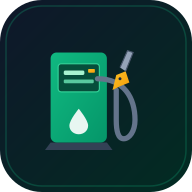

# ⛽ SpritRadar Deutschland – PWA zur Spritpreis-Ermittlung & Preisvergleich

Eine moderne, blitzschnelle und responsive Progressive Web App (PWA) zur Spritpreis-Ermittlung und zum Preisvergleich aller Tankstellen in Deutschland in Echtzeit. Optimiert für mobile Geräte und das Hosting auf **Azure Static Web Apps (Free Tier)**.



---

## 🌟 Highlights & Funktionen

1. **Standorterkennung & flexible Suche:**
   - Automatische Standorterkennung via **HTML5 Geolocation** ("Mein Standort").
   - Gezielte Adress-, Postleitzahl- und Ortssuche in Deutschland via OpenStreetMap Nominatim.
   - Schnellauswahl für Großstädte (Berlin, Hamburg, München, Köln, Frankfurt).
   - Einstellbarer Suchradius: **2 km, 5 km, 10 km, 15 km, 25 km**.

2. **Kraftstoffauswahl & Sortierung:**
   - Tabs für **Diesel (B7)**, **Super E5 (95 ROZ)** und **Super E10 (95 ROZ)**.
   - Sortierung wählbar nach **Günstigster Preis** oder **Geringste Entfernung**.
   - Filter-Toggle: **Nur geöffnete Tankstellen** anzeigen.
   - Schnellfilter nach Tankstellenmarken (Aral, Shell, Total, JET, HEM, Esso, Avia, star u. a.).

3. **Preisvergleich & Übersicht:**
   - Prominente Hero-Kachel für die **günstigste geöffnete Tankstelle** ganz oben mit direktem Preisvorteil.
   - Übersichtliche Tankstellenkarten mit Marken-Badge, Entfernung, Status ("Geöffnet" / "Geschlossen").
   - **Normgerechte Preisdarstellung:** Dritte Nachkommastelle hochgestellt (z. B. `1,68⁹ €`).
   - Sekundäre Kraftstoffpreise auf einen Blick.
   - **Navigation per Klick:** Startet die Navigation in Google Maps / Apple Maps direkt mit den Zielkoordinaten.
   - Detailansicht mit vollständigen Wochen-Öffnungszeiten und Adress-Kopierfunktion.

4. **Performance & Effizienz:**
   - **Client-seitiger 2-Minuten-Cache:** Schont Datenvolumen und verhindert das Überschreiten der Tankerkönig API-Ratenbegrenzungen.
   - **Manuelle Aktualisierung:** Refresh-Button mit Ladeanimation zum sofortigen Neuladen.
   - **Automatischer Fallback/Demo-Modus:** Sollte die API oder der Schlüssel temporär nicht erreichbar sein, zeigt die App Beispieldaten an und stürzt niemals ab.

5. **PWA-fähig:**
   - Web App Manifest (`manifest.json`) mit App-Icons.
   - Service Worker (`sw.js`) für Offline-Shell und schnelles Laden.
   - Als Standalone-App auf Homescreen (Android / iOS) oder Desktop installierbar.

---

## 🚀 Lokale Entwicklung

### Voraussetzungen
- Node.js (Version 18+ oder 20+)
- npm

### 1. Repository klonen & Abhängigkeiten installieren
```bash
npm install
```

### 2. Umgebungsvariablen konfigurieren
Erstelle oder bearbeite die Datei `.env.local`:
```env
TANKERKOENIG_API_KEY=fc7c6f9a-36f7-a256-96e0-addebf1f93a7
```

### 3. Entwicklungsserver starten
```bash
npm run dev
```
Die Anwendung ist unter [http://localhost:3000](http://localhost:3000) erreichbar.

### 4. Produktions-Build erstellen
```bash
npm run build
npm run start
```

---

## ☁️ Bereitstellung auf Azure Static Web Apps

Die Anwendung ist für das **Azure Static Web Apps Free Tier** vorkonfiguriert:
- **`staticwebapp.config.json`**: Definiert Routing-Fallbacks, MIME-Typen für Manifest & Service Worker sowie Sicherheitsheader.
- **`.github/workflows/azure-static-web-apps.yml`**: Automatisierter CI/CD-Workflow für GitHub Actions.

### Schritt-für-Schritt Einrichtung:

1. **GitHub Repository erstellen & Code pushen:**
   ```bash
   git add .
   git commit -m "feat: initial SpritRadar PWA implementation"
   git remote add origin https://github.com/<dein-user>/<dein-repo>.git
   git branch -M main
   git push -u origin main
   ```

2. **Azure Static Web App erstellen:**
   - Im Azure Portal nach **Static Web Apps** suchen und **Erstellen** wählen.
   - Tarif: **Free** (Kostenlos).
   - Bereitstellungsdetails: Mit GitHub verbinden, Repository und Branch `main` auswählen.
   - Build-Voreinstellungen:
     - **App-Standort:** `/`
     - **API-Standort:** *(leer lassen)*
     - **Ausgabestandort:** *(leer lassen)*

3. **Umgebungsvariable / Secret in Azure hinterlegen:**
   - In der Azure Static Web App unter **Einstellungen > Konfiguration > Anwendungseinstellungen**:
     - Name: `TANKERKOENIG_API_KEY`
     - Wert: `fc7c6f9a-36f7-a256-96e0-addebf1f93a7`
   - In den GitHub Repository Secrets unter **Settings > Secrets and variables > Actions**:
     - `AZURE_STATIC_WEB_APPS_API_TOKEN`: Der Deployment-Token aus dem Azure Portal.
     - `TANKERKOENIG_API_KEY`: `fc7c6f9a-36f7-a256-96e0-addebf1f93a7`.

---

## ⚖️ Lizenz & Namensnennung

- **Spritpreis-Daten:** Bereitgestellt durch [Tankerkönig](https://creativecommons.tankerkoenig.de) unter **CC BY 4.0** / Markttransparenzstelle für Kraftstoffe (MTS-K).
- **Geocoding & Kartendaten:** © [OpenStreetMap](https://www.openstreetmap.org/copyright) Mitwirkende (ODbL).
- **Code:** MIT Lizenz.
